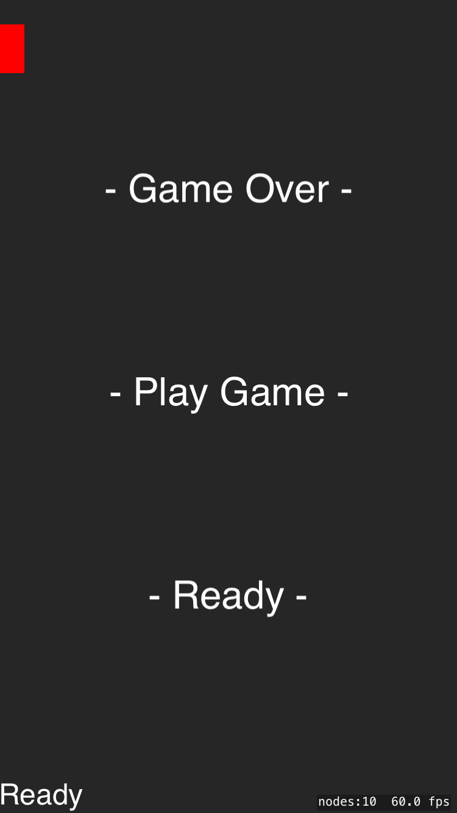

# StateMachine

This is a simple example illustrating how you might work with GKStateMachine and GKState. These classes are part of 
GameplayKit. 

Use a statemachine to organize your code into logical subsystems. A state machine might be a good choice if you 
find your project is mired in a tangled web of state variables and conditional statements. 

The state machine manages a list of states and only one state is active at any time. 

A State manages the state of something in your game. This can be a single object or the entire game. 

A state is notified by the satte machine when a state changes. This allows your states to react when: 

1) Entering this state from the previous state
2) Exiting a state

A state also recieves update events when it is the current state. 

This example creates the following states:

1) Ready State
2) Countdown state
3) Playing State
4) Game Over state 

The current state is shown in the lower left corner. The exampe starts in the Ready State. Test the example by tapping 
the Play Game label. This should put the game in the count down state. After the count down the app enters the Playing
state. In this state the red box moves across the screen left to right. When the box reaches the right side the same enters
the game over state.

## Closer look at each state

All state class must subclass GKSate. To facilitate a states collaboration with GameScene, each state class in this example 
has a scene property that is a reference to Gamescene, this is set through the initializer. 

    // This state will need a reference to the scene.
    unowned let scene: GameScene
    
    // Get the scene in the initializer
    init(scene: GameScene) {
        self.scene = scene
    }

The following gives a short description of each of the states used in this example. 

### Ready state - 

Ready state needs to set the current state label, and move the red box to the left side of the screen in preparation to 
play the game. To do this the ReadyState class uses:

    didEnterWithPreviousState

State machine will call this method on a state when entering that state from another state. 

### Countdown State - 

This class needs to display the countdown label, count down from 3 to 0, and then tell the state machine to enter the playing
state. This state sets this all up in:

    didEnterWithPreviousState()

When entering this state we set counter to 3, then create an SKAction to handle the rest. 

### Playing State - 

The playing state handles moving the box across the screen. This state will make use of:

    updateWithDeltaTime()

State machine chanels update methods to the current state. You'll have to call:

    gameState.updateWithDeltaTime(deltaTime)

Calling updateWithDeltaTime() on the state machine allows satte machine to pass the message on to the current state. 

### Gameover State - 

This state needs to add an action to the box that will make it rotate. This state uses: 

    willExitWithNextState()

This method is called on a state when exiting to a new state. 

